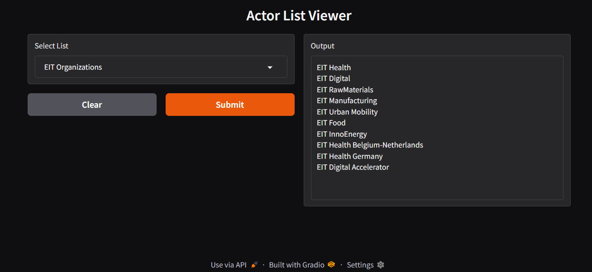

# SOCIOTYPER

**Analyze organizational relationships in European innovation news using AI**

This research tool extracts and visualizes how organizations describe their roles and relationships in news articles from the European Institute of Innovation & Technology (EIT). It identifies patterns like "EIT Health **supports** startups" or "The organization **connects** entrepreneurs with investors."



---

## What This Project Does

### The Problem
Researchers studying institutional dynamics need to understand how organizations describe themselves and their relationships. Manually reading thousands of news articles is time-consuming and inconsistent.

### The Solution
This tool automatically:
1. **Collects** news articles from EIT websites (2008-2025)
2. **Extracts** relationship triplets using AI (e.g., *Role* → *Practice* → *Counterrole*)
3. **Visualizes** the network of organizational relationships
4. **Validates** results through human review

### Example Output
From the text: *"EIT Health supports startups in developing innovative healthcare solutions"*

The tool extracts:
| Role | Practice | Counterrole |
|------|----------|-------------|
| EIT Health | supports | startups |

---

## Project Structure

```
EIT-News-Triples/
│
├── Code/                    # Python notebooks for analysis
│   ├── Actor_Catalog.ipynb  # Build actor database with dates/locations
│   └── Spacy-LLM/           # AI extraction using Mistral & Gemma models
│
├── Datasets/                # Raw news articles (2008-2025)
│   ├── 2024/                # Articles organized by year
│   ├── 2025/
│   └── ...
│
├── Triples/                 # Extracted relationships (JSON)
│   ├── eit_rich_triples_mistral.json
│   └── eit_rich_triples_gemma.json
│
├── Triples_Evaluation/      # Quality assessment data
│
├── UI/                      # Web interface (backend + frontend)
│
├── mock_ui/                 # Interactive demo (no installation needed)
│
├── Papers/                  # Reference academic papers
│
└── Images/                  # Screenshots and diagrams
```

---

## Quick Start

### Option 1: Try the Interactive Demo (No Installation)

Open the standalone demo in your browser - no Python needed:

1. Navigate to the `mock_ui` folder
2. Double-click `sociotyper-demo.html`
3. Explore the interface with sample data

### Option 2: Run Full Analysis

For detailed installation instructions, see the **[Setup Guide](SETUP_GUIDE.md)**.

**Quick start for experienced users:**

```bash
git clone https://github.com/stanley7/EIT-News-Triples.git
cd EIT-News-Triples
pip install -r requirements.txt
python -m spacy download en_core_web_sm
jupyter notebook
```

**New to Python?** The [Setup Guide](SETUP_GUIDE.md) has step-by-step instructions for beginners, including Google Colab options that require no installation

---

## How It Works

### Step 1: Data Collection
News articles are scraped from the [EIT News Portal](https://www.eit.europa.eu/news-events/news) and stored as text files organized by year.

### Step 2: AI Extraction
Two AI models analyze the text:
- **Mistral-7B**: Extracts 386 relationship triplets
- **Gemma-7B**: Extracts 295 relationship triplets

Each extraction includes:
- The organizational **role** (who is acting)
- The **practice** (what action is taken)
- The **counterrole** (who receives the action)
- Supporting **context** from the original text
- **Named entities** (organizations, locations) detected

### Step 3: Validation
Human reviewers verify the AI's extractions using the validation interface, improving accuracy over time.

### Step 4: Visualization
A network graph shows how different organizational roles connect through their practices.

---

## The Web Interface

The analyzer includes a 7-step workflow:

| Step | Tab | What You Do |
|------|-----|-------------|
| 1 | Data Upload | Upload or scrape news articles |
| 2 | Preview & Annotate | Review documents, see AI-detected entities |
| 3 | Configure Analysis | Choose AI model and settings |
| 4 | Extract Triplets | Run the extraction process |
| 5 | Validate & Train | Review and correct AI results |
| 6 | Network Analysis | Explore relationship visualization |
| 7 | Results | Export data and reports |

---

## Key Concepts

### What is a "Triplet"?
A triplet captures a relationship in the form:
> **[Actor/Role]** → **[Action/Practice]** → **[Target/Counterrole]**

Example: **EIT Food** → **trains** → **farmers**

### What is a "Sociotype"?
A sociotype is a cluster of similar roles and practices that emerge from the data. For example:
- **Innovation Ecosystem**: roles focused on supporting startups, connecting entrepreneurs
- **Education & Training**: roles focused on training professionals, educating students
- **Market Creation**: roles focused on funding ventures, mobilizing investors

### What is NER?
**Named Entity Recognition** (NER) automatically identifies organizations, people, and locations in text. For example:
- "**EIT Health**" → Organization
- "**Europe**" → Location

---

## Datasets

| Dataset | Description | Size |
|---------|-------------|------|
| Raw News Articles | Scraped from EIT website (2008-2025) | 171 files |
| Combined Dataset | All articles merged | 472 KB |
| Mistral Triples | Extracted by Mistral-7B model | 386 triplets |
| Gemma Triples | Extracted by Gemma-7B model | 295 triplets |
| Synthetic Dataset | Test data for evaluation | - |

---

## Requirements

This project uses:
- **Python** for data processing and AI
- **spaCy** for natural language processing
- **Transformers** for AI model integration
- **Gradio** for the user interface
- **D3.js** for network visualization

See [requirements.txt](requirements.txt) for the complete list.

---

## Academic Background

This project is grounded in research on institutional pluralism and organizational identity:

- **Jancsary et al. (2017)** - Structural model of institutional pluralism
- **Haans & Mertens (2024)** - Web scraping methodology for organizational research
- **Grimmer et al. (2021)** - Machine learning for social science

Full papers are available in the `Papers/` folder.

---

## Contributing

We welcome contributions! Areas where help is needed:
- Improving extraction accuracy
- Adding new data sources
- Enhancing the UI
- Documentation and tutorials

---

## License

This project is for research and educational purposes.

---

## Contact

For questions or collaboration inquiries, please open an issue on GitHub.
